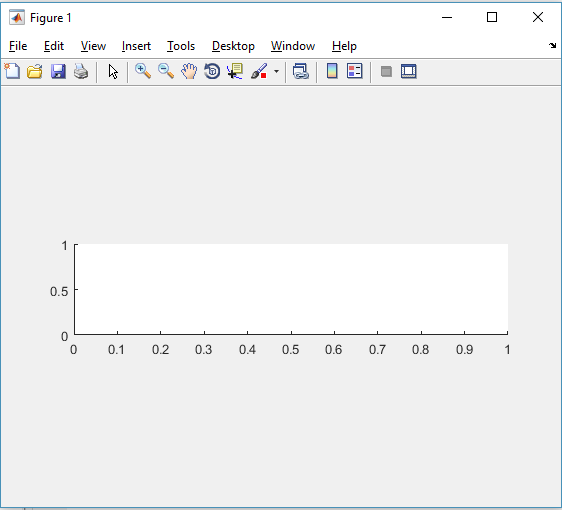

#Examen 2

*1.Cual es la diferencia entre sin() y sind()
*2.Que hace linspace(0,100,1)?
*3.Que hace [0:1:100]?
*4.Sea:  A=[1 2 3;  4 5 6; 7 8 9]; Que imprime?: A(:,2)
*5.Escribe el codigo para crear una cuadricula que contiene 9 plots, usa subplot
*6.Como harias esta grafica?

*
*10.Si conduces un camion y se suben 10 personas despues se bajan 3 pero dos no te pagan, como se llama el conductor?
